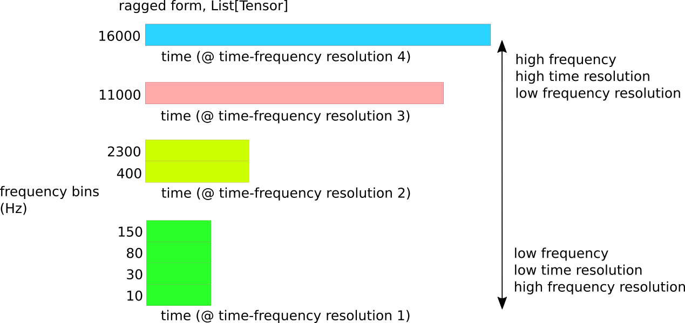
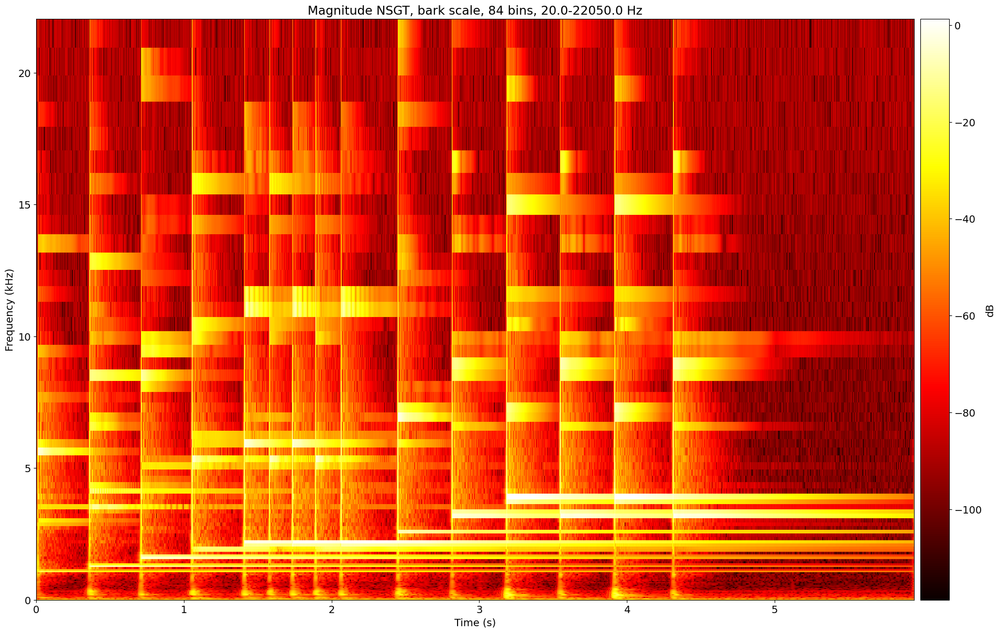

# PyTorch NSGT and sliCQ transforms

This project is a PyTorch implementation of the Nonstationary Gabor Transform and sliCQ Transform, based on [Balazs et al. 2011](http://ltfat.org/notes/ltfatnote018.pdf) and [Holighaus et al. 2012](https://arxiv.org/abs/1210.0084). It is forked from [the reference implementation](https://github.com/grrrr/nsgt) by Thomas Grill, with the following additions:
* [PyTorch](https://github.com/pytorch/pytorch/) tensor implementation for both the NSGT and sliCQ transforms, resulting in faster performance and the capability to use them in GPU deep learning models
* Bark scale based on the [Barktan formula](https://github.com/stephencwelch/Perceptual-Coding-In-Python/issues/3)
* Variable-Q scale with a frequency offset parameter, which can be seen in [Schörkhuber et al. 2014](https://www.researchgate.net/publication/274009051_A_Matlab_Toolbox_for_Efficient_Perfect_Reconstruction_Time-Frequency_Transforms_with_Log-Frequency_Resolution) and [Huang et al. 2015](https://www.researchgate.net/publication/292361602_A_Real-Time_Variable-Q_Non-Stationary_Gabor_Transform_for_Pitch_Shifting)
* Minimum slice length suggestion for a given frequency scale
* Interpolated matrix form (in addition to the reference zero-padded)
* Overlap-add procedure for the sliCQT (non-invertible)
* Example scripts included for [plotting spectrograms](./examples/spectrogram.py) and [Harmonic/Percussive Source Separation](./examples/hpss)
* High-level Torch transform classes, similar to those used in https://github.com/sevagh/xumx-sliCQ:
  ```
  from nsgt_torch.cq import NSGTBase, make_nsgt_filterbanks
  from nsgt_torch.slicq import SliCQTBase, make_slicqt_filterbanks

  nsgt_base = NSGTBase('oct', 12, 20., N, fmax=22050., matrixform="zeropad", fs=44100., device="cpu")
  nsgt, insgt = make_nsgt_filterbanks(nsgt_base)

  slicqt_base = SliCQTBase('oct', 12, 20., fmax=22050., matrixform="zeropad", fs=44100., device="cpu")
  slicqt, islicqt = make_slicqt_filterbanks(slicqt_base)
  ```

This is the standalone version of the sliCQ transform used in https://github.com/sevagh/xumx-sliCQ, and presents some improvements and differences over the [main branch](https://github.com/sevagh/nsgt/tree/main) of this repo.

## STFT vs. sliCQ spectrogram

The NSGT or sliCQ allow for nonuniform time-frequency resolution. Following the example of the constant-Q transform, music can be analyzed by maintaining a constant-Q center frequency to frequency resolution ratio per bin, to have high frequency resolution at low frequencies and high time resolution at high frequencies.

The spectrograms below compares the magnitude STFT and the magnitude sliCQT of the [LTFAT glockenspiel signal](https://github.com/ltfat/ltfat/blob/master/signals/gspi.wav) with the xumx-sliCQ defaults of 262 bins on the Bark scale between 32.9-22050 Hz:


By using a varying time-frequency resolution, transients and tonal sounds are distinguished more clearly, making it a good choice for representing the spectral content of musical signals.

The spectrogram above was generated with the [examples/spectrogram.py](https://github.com/sevagh/nsgt/blob/torch/examples/spectrogram.py) script:
```
(nsgt-torch) $ python examples/spectrogram.py \
                ./gspi.wav --sr 44100 \
                --scale=bark --fmin 32.9 --fmax 22050 --bins 262 \
                --plot
```

## Tensor sliCQ transform

In the diagram below, the NSGT/sliCQ transform output of an audio signal using a simple nonlinear frequency scale, grouped into 4 time-frequency resolution blocks (or buckets): `[10, 30, 80, 150], [400, 2300], [11000], [16000] Hz`, is demonstrated in a simplified diagram:



Returned types:

| Parameters | Return type | Shape | Dtype |
|------------|------------|------------|------------|
| **matrixform=True**, real=True, multichannel=True | `torch.Tensor` | (slices,frequency,max(time)) | torch.Complex64 |
| **matrixform=False**, real=True, multichannel=True | `List[torch.Tensor]` | [(slices,freqs1,time1), (slices,freqs2,time2), ...] | torch.Complex64 |

The frequency bins in the ragged case are grouped together by their time resolution. To get the absolute frequency, you need to maintain a frequency index while iterating over the returned list of tensors:
```
freq_idx = 0
for i, C_block in enumerate(jagged_slicq_output):
    freq_start = freq_idx

    print(f'this tensor starts at frequency {freq_start}')

    # advance global frequency pointer
    freq_idx += C_block.shape[2]
```

Here's a sample output from the script [examples/ragged_vs_matrix.py](https://github.com/sevagh/nsgt/blob/torch/examples/ragged_vs_matrix.py):

```
$ python examples/ragged_vs_matrix.py ./mestis.wav --sr 44100 \
              --scale=cqlog --fmin 83.0 --fmax 22050 --bins 12
NSGT-sliCQ jagged shape:
        block 0, f 0: torch.Size([2, 2, 1, 3948])
        block 1, f 1: torch.Size([2, 2, 1, 2024])
        block 2, f 2: torch.Size([2, 2, 1, 3472])
        block 3, f 3: torch.Size([2, 2, 1, 5768])
        block 4, f 4: torch.Size([2, 2, 1, 9580])
        block 5, f 5: torch.Size([2, 2, 1, 15912])
        block 6, f 6: torch.Size([2, 2, 1, 26432])
        block 7, f 7: torch.Size([2, 2, 1, 43908])
        block 8, f 8: torch.Size([2, 2, 1, 72932])
        block 9, f 9: torch.Size([2, 2, 1, 121148])
        block 10, f 10: torch.Size([2, 2, 1, 201240])
        block 11, f 11: torch.Size([2, 2, 1, 334276])
        block 12, f 12: torch.Size([2, 2, 1, 537856])
        block 13, f 13: torch.Size([2, 2, 1, 16])
recon error (mse): 6.658166853412695e-07
```

Compare this to the matrix form:
```
$ python examples/ragged_vs_matrix.py ./mestis.wav --sr 44100 \
              --scale=cqlog --fmin 83.0 --fmax 22050 --bins 12 \
              --matrixform
NSGT-sliCQ matrix shape: torch.Size([2, 2, 14, 537856])
recon error (mse): 2.0801778646273306e-06
```

## Ragged vs. matrix

Due to the complicated nature of the sliCQ transform, it's not very simple to describe how to swap between the ragged and matrix forms. There is a zero-padding step, but not just at the final step before the return.

* In [nsgtf.py](https://github.com/sevagh/nsgt/blob/torch/nsgt/nsgtf.py#L69-L75), zeros are inserted in between the first and second halves of the lower time resolution coefficients to pad them to the size of the largest, followed by an ifft call
* The `arrange` function in [slicq.py](https://github.com/sevagh/nsgt/blob/torch/nsgt/slicq.py#L40) swaps the beginning and ending portions of the transform according to the Blackman-Harris window step

It's best to think of them separately, and it's important to note that in my experience, trying to use the matrix form in a neural network led to subpar results (most probably due to the murky effect of the zero-padding, or "smearing", of the low time resolutions into larger ones).

## Arbitrary frequency scales

I recently included the "power of two" frequency scale, to show that the NSGT/sliCQT is flexible and can use any monotonically-increasing frequency scale. The sliCQT gives you the Fourier transform coefficients for your desired frequency scale, with a perfect inverse operator and no fuss.

Power of two frequency scale, frequencies and Q factors:
* Pow2Scale, 20-22050 Hz (fmin-fmax), 15 bins
* Starting bin = 5, since 2\*\*5 = 32 Hz is the first power-of-two past 20 Hz
* Frequencies (Hz): 32, 64, 128, 256, 512, 1024, 2048, 4096, 8192, 16384
* Q factors (constant-Q by default): 0.72 throughout

Spectrogram of the famous LTFAT tonal/transient [Glockenspiel signal](https://ltfat.org/doc/signals/gspi.html) with the above frequency scale:


Generated with:
```
$ python examples/spectrogram.py --fmin 20 --fmax 22050 --scale pow2 --sr 44100 --bins 15 --nonsliced --plot ./gspi.wav
```

## NSGT vs. sliCQT - sllen, trlen, and noninvertible half-overlap of slices

The sliCQT is the sliced version of the NSGT. The spectrogram script takes a `--nonsliced` argument to do the regular NSGT (which processes the entire input signal):



```
$ python examples/spectrogram.py --fmin 20 --fmax 22050 --scale bark --sr 44100 --bins 84 --nonsliced ./gspi.wav --plot
```

Otherwise the sliced version with `--sllen` and `--trlen` (slice and transition, analogous to the STFT window and hop) is used:


```
$ python examples/spectrogram.py --fmin 20 --fmax 22050 --scale bark --sr 44100 --bins 84 --sllen 8192 --trlen 2048 ./gspi.wav --plot
```

Finally, note that the sliCQT is different from the NSGT in that it outputs slices that have a 50% overlap with the adjacent slices. The `--flatten` argument shows what happens if you don't overlap-add but just flatten the tensor:


```
$ python examples/spectrogram.py --fmin 20 --fmax 22050 --scale bark --sr 44100 --bins 84 --sllen 8192 --trlen 2048 ./gspi.wav --plot --flatten
```

This is a non-invertible operation, and to synthesize the time-domain audio back from the transform you need to have the previous, non-overlap-added slices. However, for the neural network to learn from the spectrogram, the overlapped version worked better. In my neural network, [xumx-sliCQ](https://github.com/sevagh/xumx-sliCQ), I had difficulty with this, and needed an extra ConvTranspose2d layer to double the sliCQ coefficients to reproduce the non-overlapped version: https://github.com/sevagh/xumx-sliCQ/blob/main/xumx_slicq/model.py#L92-L94

Also note that [Essentia mentioned the same half-overlap as a tricky situation](https://mtg.github.io/essentia-labs/news/2019/02/07/invertible-constant-q/). Perhaps the next evolution of the sliCQT can make it easier to reason about the half-overlapped slices such that we can go to the half-overlapped representation and back without any reconstruction error.

## Performance

This is not an exhaustive benchmark, but a time measurement of the forward + backward sliCQ transform on various devices, compared to the original NSGT library, **omitting** the cost of memory transfer the song from host to the GPU device.

Matrix transforms:

| Library | Transform params | Device | Execution time (s) |
|---------|-----------|--------|--------------------|
| Original with [numpy.fft](https://numpy.org/doc/stable/reference/routines.fft.html) backend | real=True, multithreading=False | CPU (Ryzen 3700x) | 7.13 |
| Original with [numpy.fft](https://numpy.org/doc/stable/reference/routines.fft.html) backend | real=True, multithreading=True | CPU (Ryzen 3700x) | 4.87 |
| NSGT PyTorch | real=True | CPU (Ryzen 3700x) | 3.05 |
| NSGT PyTorch | real=True | GPU (3080 Ti) | 0.38 |
| NSGT PyTorch | real=True | GPU (2070 SUPER) | n/a (OOM on 8GB vram) |

Ragged transforms:
| Library | Transform params | Device | Execution time (s) |
|---------|-----------|--------|--------------------|
| Original with [numpy.fft](https://numpy.org/doc/stable/reference/routines.fft.html) backend | real=True, multithreading=False | CPU (Ryzen 3700x) | 2.08 |
| Original with [numpy.fft](https://numpy.org/doc/stable/reference/routines.fft.html) backend | real=True, multithreading=True | CPU (Ryzen 3700x) | 2.37 |
| NSGT PyTorch | real=True | CPU (Ryzen 3700x) | 1.14 |
| NSGT PyTorch | real=True | GPU (2070 SUPER) | 0.64 |
| NSGT PyTorch | real=True | GPU (3080 Ti) | 0.60 |

The transform execution time was measured with the [examples/benchmark.py](https://github.com/sevagh/nsgt/blob/torch/examples/benchmark.py) script on the full length song [Mestis - El Mestizo](https://www.youtube.com/watch?v=0kn2doStfp4) with sliCQ parameters `--scale=bark --bins=512 --fmin=83. --fmax=22050.` The test computer is running Fedora 33 (amd64) with an AMD Ryzen 3700x processor, 64GB DDR4 memory, and NVIDIA 3080 Ti and 2070 SUPER. The Bark scale was chosen as it results in a smaller transform than the constant-Q log scale (but still not small enough to fit the matrix form on the 2070 SUPER's 8GB vram).

Benchmark invocation arguments:
```
--scale=bark --bins=512 --fmin=83.0 --fmax=22050.0 --sr=44100 ./mestis.wav  --torch-device="cpu"
--scale=bark --bins=512 --fmin=83.0 --fmax=22050.0 --sr=44100 ./mestis.wav  --torch-device="cuda:0"
--scale=bark --bins=512 --fmin=83.0 --fmax=22050.0 --sr=44100 ./mestis.wav  --torch-device="cuda:1"
--scale=bark --bins=512 --fmin=83.0 --fmax=22050.0 --sr=44100 ./mestis.wav  --old
--scale=bark --bins=512 --fmin=83.0 --fmax=22050.0 --sr=44100 ./mestis.wav  --old --multithreading
--scale=bark --bins=512 --fmin=83.0 --fmax=22050.0 --sr=44100 ./mestis.wav  --old --matrixform
--scale=bark --bins=512 --fmin=83.0 --fmax=22050.0 --sr=44100 ./mestis.wav  --old --matrixform --multithreading
--scale=bark --bins=512 --fmin=83.0 --fmax=22050.0 --sr=44100 ./mestis.wav  --matrixform --torch-device="cpu"
--scale=bark --bins=512 --fmin=83.0 --fmax=22050.0 --sr=44100 ./mestis.wav  --matrixform --torch-device="cuda:0"
--scale=bark --bins=512 --fmin=83.0 --fmax=22050.0 --sr=44100 ./mestis.wav  --matrixform --torch-device="cuda:1"
```

Note that the goal of the GPU implementation is not the absolute fastest computation time, but the ability to compute the forward and inverse NSGT and sliCQ transforms on-the-fly in a training loop for GPU machine or deep learning models.
